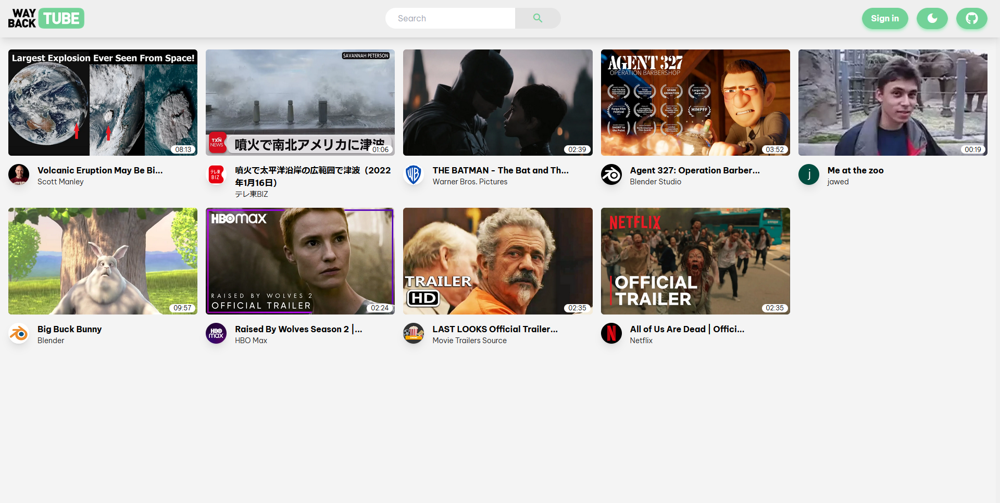
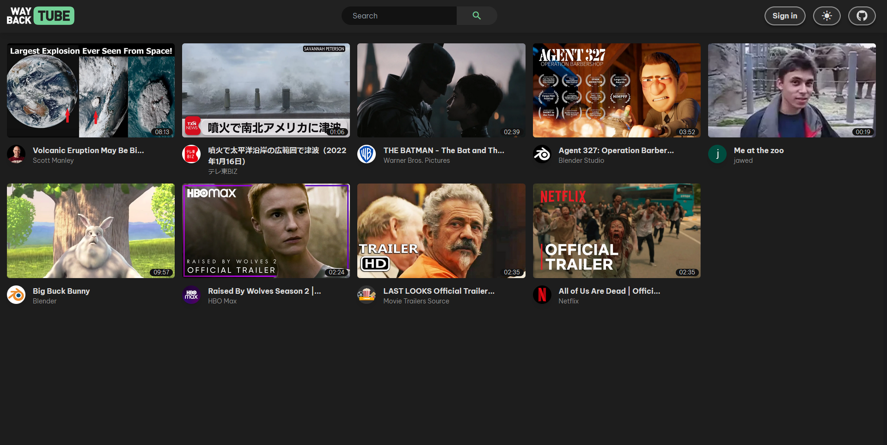
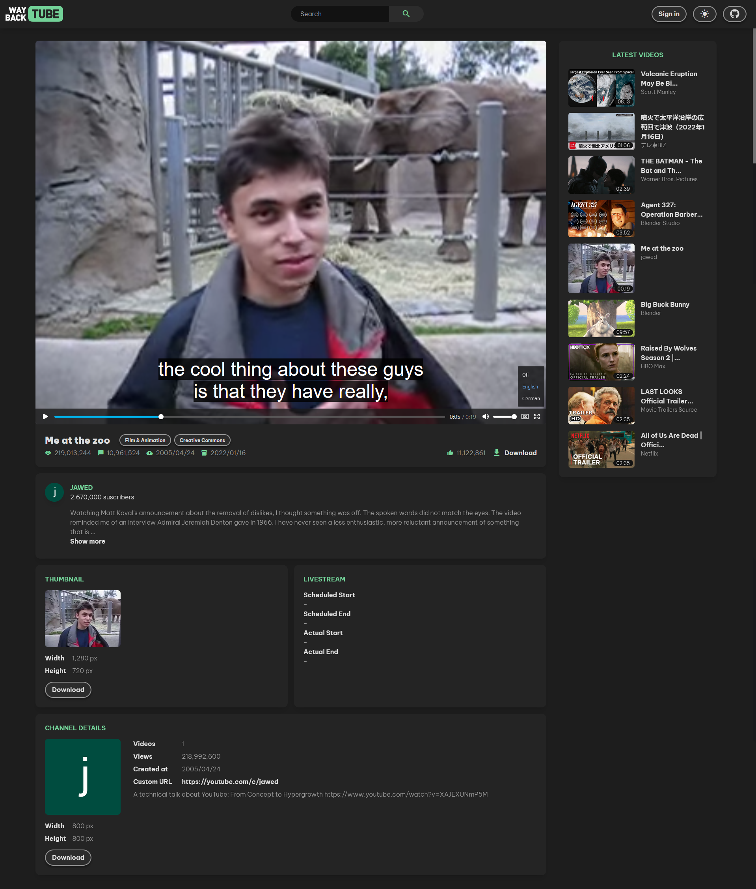
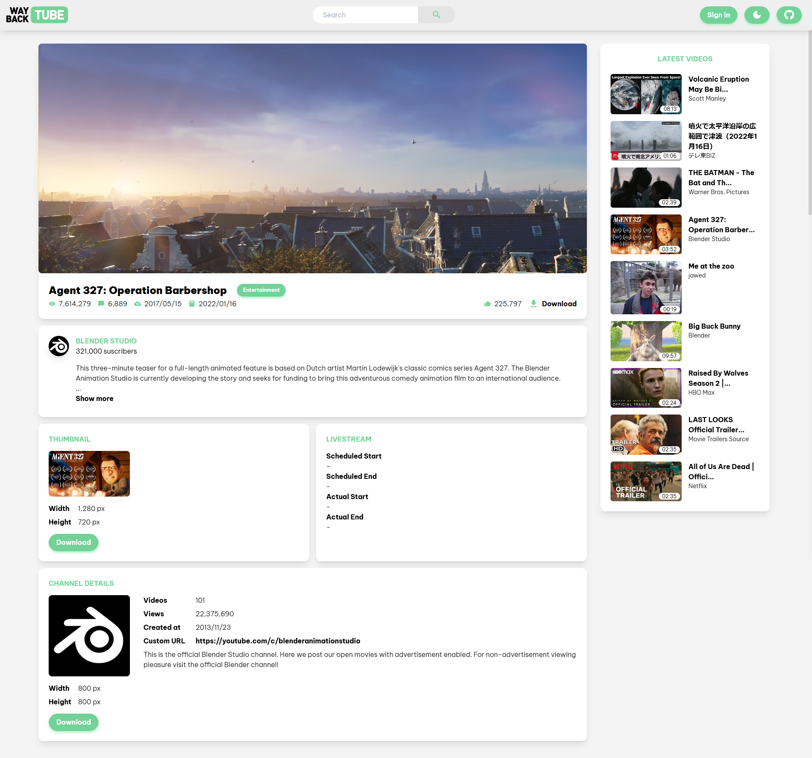
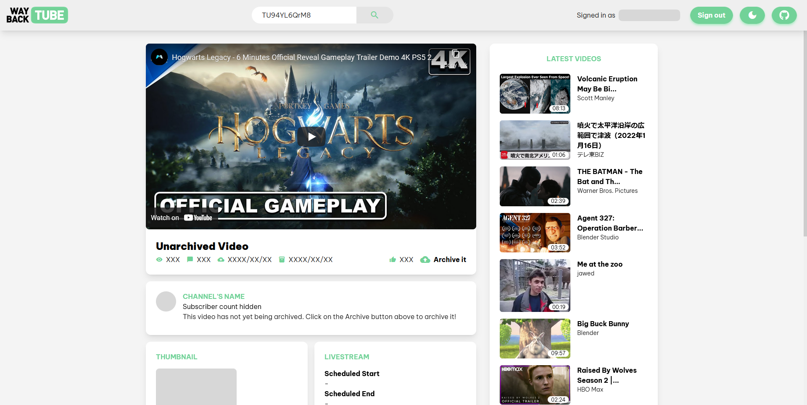
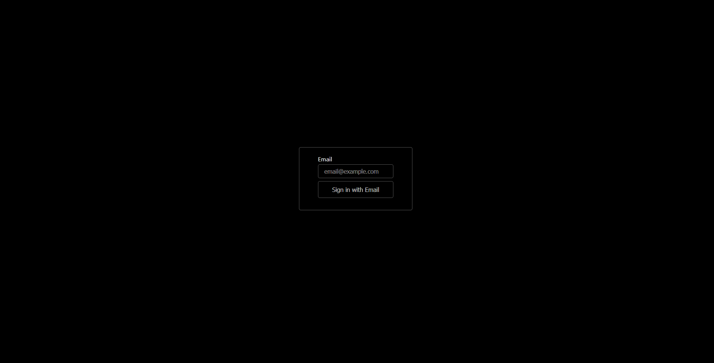
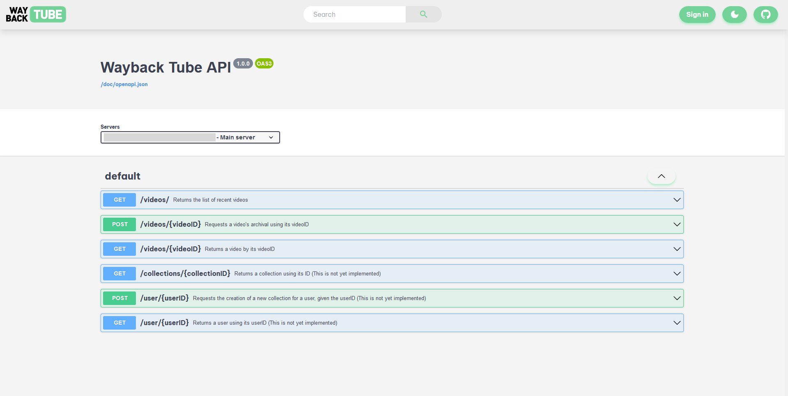

# Wayback Tube
## Projet's description

Wayback Tube is a self-hosted web service that can be used to archive videos from YouTube. The main goal is to provide a tool that is simple to deploy, always archives the best possible audio and video quality, retrieves as much publicly available information as possible, and displays the archives in a neat, simple, and familiar interface.

The name of the project is a nod to the [Wayback Machine](https://en.wikipedia.org/wiki/Wayback_Machine "Wayback Machine") by the [Internet Archive](https://en.wikipedia.org/wiki/Internet_Archive "Internet Archive"), combined with the name YouTube. The idea is that the Wayback Tube could serve a similar purpose to the Wayback Machine but specialized in archiving YouTube videos.

## Functionalities

- Download publicly available metadata using the [YouTube Data API v3](https://developers.google.com/youtube/v3/docs).
- Downloads the videos using [yt-dlp](https://github.com/yt-dlp/yt-dlp).
- Downloads and support for video subtitles.
- Displays archived videos on the home page and as recommended videos on the side of the player.
- Displays most gathered metadata on the video page.
- Provides buttons to download the video or channel thumbnails and the video file.
- Accounts and sign-in. Only authenticated users can archive videos. User creation can be disabled.
- Automatically follows the system light or dark theme, which can also be manually overwritten.

## Screenshots

### Home page
On the main page, the user can see the latest videos. The top bar is available on all pages and allows the user to go back to the home page by clicking the Wayback Tube logo. The user can also search for a video by typing its ID in the Search bar. They can also Sign in/out, toggle the light/dark mode, and visit Wayback Tube's GitHub page.

Same page in dark mode.


### Video page
On the video page, the user can play the video. The player is the standard HTML5 video player so its appearance can vary depending on your OS and web browser. It natively supports subtitles as seen below. On the right, the user can also see all the latest videos. The user can also download the video, download the video's thumbnail, or download the channel's thumbnail.


Same page in light mode.


If the video is not yet archived, the video is still displayed by using YouTube's embedded player. The user can then click on *Archive it* to archive the video. The webpage will be automatically reloaded once the video has been successfully archived.


### Sign-in
Very simple sign-in page by NextAuth.


### API documentation
API documentation using Swagger-UI to display the [OAS 3.0](https://swagger.io/resources/open-api/) swagger file. The page is available at /api or /doc/api


## Technical Overview
- [Next.js](https://nextjs.org/) Web App:
	-   Typescript: a superset of JavaScript which makes it a strongly typed language
	-   Styling using [Tailwind CSS](https://tailwindcss.com/) and [Material Design](https://material.io) and [Material Icons](https://fonts.google.com/icons).
-   [Prisma](https://www.prisma.io/) (an [ORM](https://en.wikipedia.org/wiki/Object%E2%80%93relational_mapping)):
	-   High flexibility for the database type (support for PostgreSQL, MySQL, SQL Server, SQLite and MongoDB).
	-   [Prisma Studio](https://www.prisma.io/studio): visual database browser (optional).
-   REST API + Documentation using [OAS 3.0](https://swagger.io/resources/open-api/).
-   Auth using [NextAuth.js](https://next-auth.js.org/):
	-    High flexibility for the login provider (support for GitHub, Facebook, Twitter, emails, and 50 others).

## Archive Structure
The archives are stored in another folder that can be initialized using [Wayback-Tube-DL](https://github.com/Wayback-Tube/Wayback-Tube-DL) (which includes a script to automatically download [yt-dlp](https://github.com/yt-dlp/yt-dlp) and other dependencies). The archives are located in the *public* folder. Here is its structure:

- **public/**
	- **channels/**
		- **[Channel ID].webp** -> The channel's thumbnail
	- **videos/**
		- **[Video ID].mp4** -> The video file
		- **[Video ID].info.json** -> Informations collected by [yt-dlp](https://github.com/yt-dlp/yt-dlp) during the download process.
		- **[Video ID].webp** -> The video's thumbnail. Older videos only provide JPG thumbnails, we decided to use [cwebp](https://developers.google.com/speed/webp/docs/cwebp) to convert them into WebP. This way, the file extension doesn't have to be saved in the database.
		- **[Video ID].[Language code].vtt** -> Subtitle file saved in [WebVTT](https://developer.mozilla.org/en-US/docs/Web/API/WebVTT_API) format.
		- **[Video ID].live_chat.json** -> If the video was a livestream and live chat was enabled, the live chat is saved in JSON Lines format. The exact format is undocumented because it's using the now deprecated [https://www.youtube.com/live_chat_replay/get_live_chat_replay](https://www.youtube.com/live_chat_replay/get_live_chat_replay) endpoint.

## Video File Format

- **Video codec** -> AV1, VP9, or AVC1 (H.264) in this order of preferences. The selected codec depends on its availability on YouTube's servers (videos uploaded a long time ago were only encoded in AVC1 for example).
- **Audio codec** -> OPUS.
- **Embedded subtitles** -> TX3G (MPEG-4 Timed Text).
- **Container** -> MP4. While MKV is more flexible in than MP4, it isn't compatible for replay in the browser, which is way we decided to not use it. Webm format was our first choice. However it only supports VP9 or AV1, which means older videos that use the AVC1 codec couldn't be saved.
- **Other** -> Embedded title, channel name, video description, publishing date, and video thumbnail.

## Metadata
Here is the list of all retrieved metadata:
- Id
- Title
- Description
- Publishing date
- Channel
	- Id
	- Title
	- Description
	- Publishing date
	- Custom URL
	- Thumbnail (size and file)
	- View count
	- Suscribers count
	- Video count
- Thumbnail (size and file)
- Tags
- Category name
- Is the video 3D? 360°? Unlisted? Creative Common? Made for kids? HDR?
- View count
- Like count
- Comment count
- If it's a livestream, when it was scheduled to start/stop, and when it actually started/stopped.
- Subtitles (language code and file)
- Video file
	- Width
	- Height
	- File size
	- Framerate
	- Audio/video codecs

## Installation

### Using Docker Compose
Not yet available

### Using NPM

#### Wayback-Tube-DL
In order to download videos, you'll have to clone and setup this other repository [Wayback-Tube-DL](https://github.com/Wayback-Tube/Wayback-Tube-DL).
1. Clone the project:
	```bash
	git clone https://github.com/Wayback-Tube/Wayback-Tube-DL.git
	cd Wayback-Tube-DL
	```
	
2. Install the dependencies by running the installer:
	```bash
	./install.sh
	```

3. Configure a web server or proxy to serve the files statically. The following example is using Caddy Server:
	```caddy
	the-domain-hosting-waybacktube-dl.com {
			root * /local/path/to/Wayback-Tube-DL/public
			file_server browse
			header Content-Type "application/octet-stream"
			header Access-Control-Allow-Origin "https://the-domain-hosting-waybacktube.com"
	}
	```
	The header `Content-Type` makes sure that the files are served as downloadable assets instead of just displaying them in the web browser.
	The header `Access-Control-Allow-Origin` is necessary or else the subtitles won't be able to show up in the video player.

#### Wayback-Tube-Front
1. Clone the project:
	```bash
	git clone https://github.com/Wayback-Tube/Wayback-Tube-Front.git
	cd Wayback-Tube-Front
	```

2. Install the dependencies:
	```bash
	npm install
	```

3. Create an env file:
	```bash
	cp .env.example .env.local
	nano .env.local
	```

4. Set all the variables in the created Env file:
	```txt
	EMAIL_SERVER_USER=example@example.com
	EMAIL_SERVER_PASSWORD=myPassword
	EMAIL_SERVER_HOST=smtp.example.com
	EMAIL_SERVER_PORT=587
	EMAIL_FROM=noreply@example.com

	NEXTAUTH_URL=https://the-domain-hosting-waybacktube.com
	YOUTUBE_API_KEY=XXXXXXXXXXXXXXXXXXXXXXXXXXXXXXXXXXXXXXX
	WAYBACK_TUBE_DL_PATH=/local/path/to/Wayback-Tube-DL
	NEXT_PUBLIC_STATIC_URL=https://the-domain-hosting-waybacktube-dl.com
	```

5. Initialize the database using Prisma
	```bash
	npx prisma db push
	```

7. Run the web server:
	```bash
	./run_wayback.sh
	```
	The website is now available on port 3000

#### (Optional) Prisma Studio
1. If you want to explore the database you can run Prisma Studio:
	```bash
	./run_prismastudio.sh
	```
	Prisma Studio is now available on port 3001

## Known Issues and Limitations

- This project uses [yt-dlp](https://github.com/yt-dlp/yt-dlp) to download the video files, subtitles, live chat, and other metadata. Any limitation from yt-dlp will also be present in Wayback Tube. For example, if a video is geoblocked or private, yt-dlp won't be able to download it and it won't show up in Wayback Tube.
- There is no pagination when retrieving the list of available videos. This is a problem for larger libraries.

## Roadmap

- **Mobile support**: the current interface is targeted to desktop users. The UI needs to adapt to portrait-oriented screens
- **More downloads**: being able to download the subtitle files, or the metadata as a JSON file.
- **Docker compose deployment**: being able to deploy the project using Docker with a Docker compose file.
- **Progression bar**: when archiving a video, display an indicator that the archiving is taking place. If possible, display the progression and estimated time. 
- **Tags**: retrieved the tags from YouTube API and display them under the video.
-  **Better search**: being able to search words in video titles and tags, and having advanced search parameters like the resolution, language for the subtitles, length... 
-   **Live chat replay**: for livestreams, display the live chat on the side of the video, including superchats, memberships notification and regular messages.
-   **Comments**: also downloads and show the video's comments.
-   **Channels**: being able to browse all archived videos from a channel. 
-   **Audio extraction**: give the user the ability to extract the audio from a video which can be useful for music, audiobooks, podcasts… Either the audio file is stored alongside the video file, or is generated on demand.
-   **Viewed videos**: keep track of viewed videos in order to only recommend unviewed videos to the user. This only opens up the possibility to add a History feature.
-   **Video progress**: similarly to YouTube, display the watch progress at the bottom of unfinished videos.
-   **Collections**: similarly to YouTube Playlists, collection would be a way for the user to organize videos available on the platform. These collections should also be shareable with a link.
-   **Interactivity**: give the user the possibility to like, dislike, subscribe, add to collection, and comment on a video. Those interaction should update the displayed values for a given video, but an itemized view should also be provided on hover for transparency.
-   **YouTube Integration**: the user could have an integration with their YouTube account (read-only API). This would make it possible to import one or more of their YouTube playlists as Wayback Tube collections. Furthermore, these playlists could be synced, meaning that if the user adds a video to one of the playlists within YouTube’s interface, the video will be archived automatically on Wayback Tube. This makes the service very convenient to use, especially for mobile users.
-   **Automatic archiving**: a dynamic collection will automatically import new videos according to certain parameters: a channel, a tag, string in the title of a video, length of the video… Combined together, this can create powerful queries.
-   **More platforms**: adding more streaming platforms such as Twitch, Dailymotion, Vimeo, Twitter, NicoNico...
-  **Wayback Tube Federation**: it is unlikely that any singular organization has the capacities to store any substantial amount of YouTube immense video collection. This project allows for smaller archival project to exists where groups or individual will archive specific videos or type of videos that they want to preserve for posterity. If we imagine a future where many Wayback Tube instances have been deployed, it would be interesting to be able to connect instances together to form a network of independent servers. Similarly to the use of BitTorrent trackers, Waybay Tube Trackers could be used to store a list of videos IDs and which servers have archived them. This way, any user on any instances of Wayback Tube will be able to browse through videos archived in all connected servers. This would be inspired by [PeerTube](https://joinpeertube.org/)'s model, "a federation of interconnected hosting services." 
